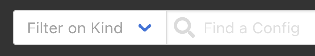
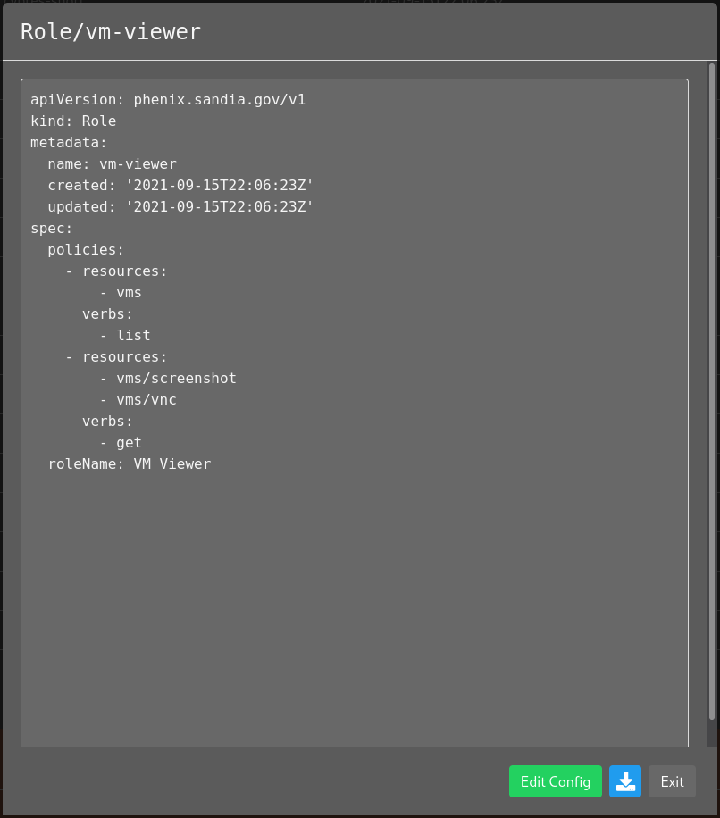
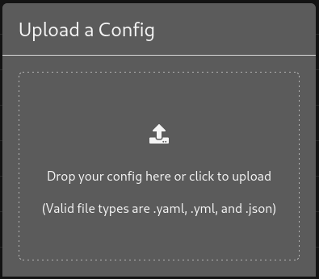
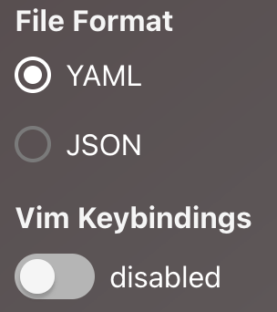
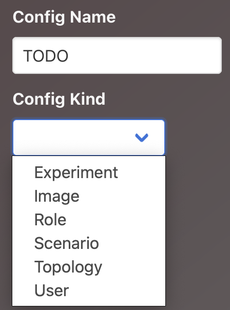
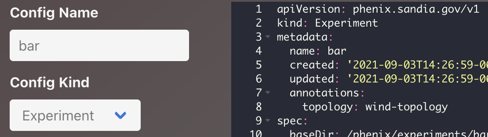
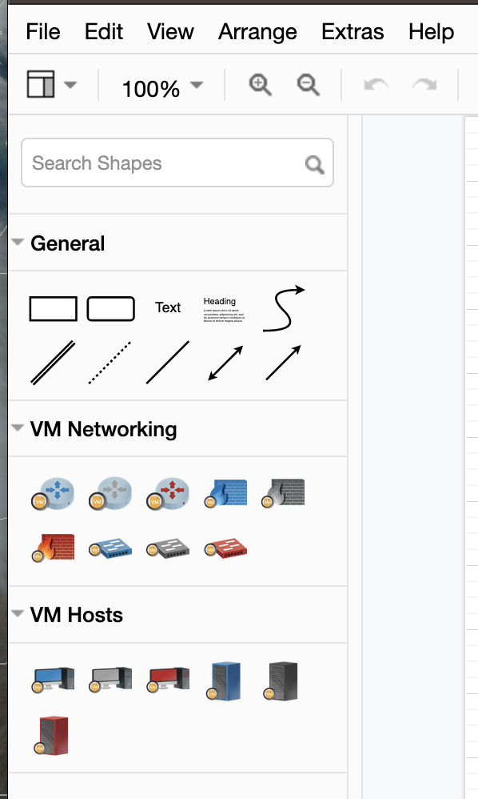
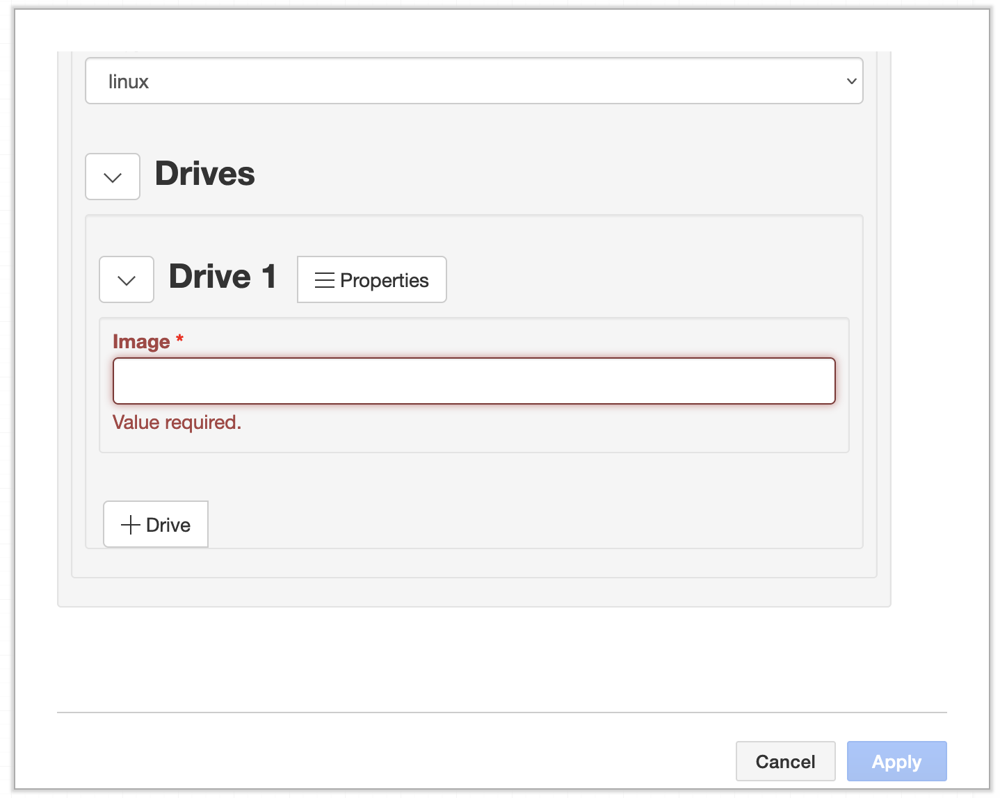
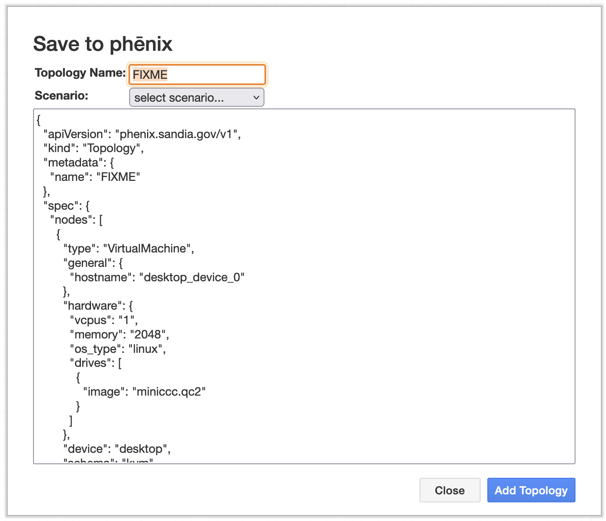

# Configuration Files

`phenix` currently supports six (6) different configuration file types:

1. [Topology](#topology)
1. [Scenario](#scenario)
1. [Experiment](#experiment)
1. [Image](#image)
1. [User](#user)
1. [Role](#role)

Typically, users will create `Topology` and `Scenario` configuration files by
hand, while the rest will be generated by `phenix` using available commands.
However, it is possible to create all configuration file types by hand if
necessary.

!!! note
    Configuration files can also be created, viewed, and deleted via the Web-UI
    (see [Web-UI section](#web-ui) below).

Configuration files are versioned using a header section based heavily on what
[Kubernetes](https://kubernetes.io) does. Each configuration file will have a
header section that looks like the following:

```
apiVersion: phenix.sandia.gov/v1
kind: Topology
metadata:
  name: foobar
spec:
  ...
```

In the example above, the `kind` field represents the type of configuration file
(e.g., Topology, Scenario, Image). The `apiVersion` field represents the
version the `spec` section conforms to (currently there is only `v1` for all
configuration types except `Scenario`, which is `v2`), and the `spec` section
will contain the actual details for the configuration type based on the
configuration schema. Note that, at least in the header section, keys are
camel-case and begin with a lowercase letter, while values are camel-cased but
begin with a capital letter.

!!! note
    Throughout the documentation, we mention `creating configurations manually`.
    When we say this, we mean passing a YAML or JSON configuration file of any
    type to the `phenix config create` command.

## Topology

The `Topology` configuration is one of the core configuration types for
`phenix`, as it describes a network topology to be deployed in `minimega` that
can be used by one or more experiments to be executed.

A topology is comprised of one or more _nodes_, which can either be a VM
(`external: false` - the default) or an external node (`external: true`), each
including system descriptions and configurations, as well as any networking
settings required to connect all of the nodes in a topology together. This
configuration becomes the basis for most of the minimega commands later created
in the relevant minimega startup script (at least for internal VMs).

### Default Settings

If left unmodified or unset, the following are the default settings for each
node:

- external will be set to `false`
- memory will be set to `512`MB
- vcpus will be set to `1`
- snapshot will be set to `true`
- no network settings will be included

### Required Values

Each topology must have a unique name, which should be lowercase and not include
spaces. In addition, each node in the topology must:

- have a specified type &mdash; the available types are defined in the
  [schema](schema.md#node-schema)
- have a unique hostname
- have an OS type of `linux` or `windows`
- have a disk image assigned

### Optional Values

Optional values for a node in the topology configuration can include:

- static network configurations
- specific memory values (e.g., `1-16`GB)
- specific VCPUs values (e.g., `1-4`)
- additional disk storage
- file injections
- labels, which are typically used by phēnix apps
- routing ruleset(s)
- delay triggered by `user`, `time`, or `c2` (command and control)

#### Delay Start

It is possible to delay the start of a VM with the `delay` value. There are
three options available to set, but on only one option can be set:

1. `user` is a boolean value and when set to `true` the VM will require a manual
   start either through the phēnix UI or command line (the latter can be by
   phēnix or minimega commands).

1. `time` is a string that is set as a delay in minutes; e.g., `5m`.

1. `c2` requires minimega command and control. Note in the example below that
   the hostname `AD1` will be delayed starting until the VM `host-00` has
   started and checked in with minimega command and control. It is possible to
   have multiple hostnames included. `useUUID` is an additional boolean value
   setting, per hostname, that will watch for the UUID instead of the hostname
   to register with minimega command and control.

!!! note
    If one or more VMs are set with a delayed start, the UI will display a blue
    tag in the Delay column next to the Screenshot column. The tag will indicate
    what type of dealy was set. Once all the delayed VMs have started, the Delay
    column will no longer be visible.

#### Network Address Translation (NAT)

For nodes of type `Router`, basic source NAT can be configured to masquerade
packets from one or more networks out a specific interface. For example, assume
a router has three interfaces &mdash; `eth0, eth1, eth2`. `eth0` is connected to
the Internet, while `eth1, eth2` are connected to networks that use private IP
space. To masquerade packets from `eth1, eth2` out `eth0` the following
configuration could be used.

```
network:
  nat:
    - out: eth0
      in:
        - eth1
        - eth2
```

### External Nodes

There may be cases where an experiment includes external devices (hardware in
the loop) that should still be included in the topology for the purposes of the
[State of Health](/state-of-health) network diagram, state of health
reachability checks, or for use by custom user apps. External nodes can be
included in the topology by marking them as `external: true`. Among other
things, this will prevent them from being deployed as a VM in minimega. The
configuration schema for an external node in the topology is defined
[here](/schema/#external_node-schema).

!!! warning
    Do not use `external: false` for internal nodes that should be deployed in
    minimega. Instead, don't include the `external` configuration key at all.
    This is a quirk of how we internally decide which node schema should be used
    (via `oneOf`).

### Example

A contrived, four node example &mdash; three VMs and a router &mdash; is given
below, and is driven by the
[topology schema described here](schema.md#topology-schema).

```
apiVersion: phenix.sandia.gov/v1
kind: Topology
metadata:
  name: foobar
spec:
  nodes:
  - type: VirtualMachine
    general:
      hostname: host-00
      snapshot: true
    delay:
      user: true
    hardware:
      os_type: linux
      drives:
      - image: ubuntu.qc2
    injections:
      - src: foo/bar/sucka.fish
        dst: /data/sucka.fish
      - src: /foo/bar/sucka/fish.sh
        dst: /data/fish.sh
    network:
      interfaces:
      - name: IF0
        vlan: EXP-1
        address: 192.168.10.1
        mask: 24
        gateway: 192.168.10.254
        proto: static
        type: ethernet
      - name: IF1
        vlan: MGMT
        address: 172.16.10.1
        mask: 16
        proto: static
        type: ethernet
  - type: VirtualMachine
    general:
      hostname: host-01
      snapshot: true
      do_not_boot: false
    delay:
      time: 5m
    hardware:
      os_type: linux
      drives:
      - image: ubuntu.qc2
    network:
      interfaces:
      - name: IF0
        vlan: EXP-1
        address: 192.168.10.2
        mask: 24
        gateway: 192.168.10.254
        proto: static
        type: ethernet
      - name: IF1
        vlan: MGMT
        address: 172.16.10.2
        mask: 16
        proto: static
        type: ethernet
      - name: S0
        vlan: EXT
        address: 10.0.0.1
        mask: 24
        proto: static
        type: serial
        udp_port: 8989
        baud_rate: 9600
        device: /dev/ttyS0
  - type: VirtualMachine
    general:
      hostname: AD1
      snapshot: true
    delay:
      c2:
      - hostname: host-00
        useUUID: false
    hardware:
      os_type: windows
      drives:
      - image: win-svr-2k8.qc2
    network:
      interfaces:
      - name: IF0
        vlan: EXP-1
        address: 192.168.10.250
        mask: 24
        gateway: 192.168.10.254
        proto: static
        type: ethernet
      - name: IF1
        vlan: MGMT
        address: 172.16.10.3
        mask: 16
        proto: static
        type: ethernet
  - type: Router
    labels:
      ntp-server: "true"
    general:
      hostname: router-00
      snapshot: true
    hardware:
      os_type: linux
      drives:
      - image: vyatta.qc2
    network:
      interfaces:
      - name: IF0
        vlan: EXP-1
        address: 192.168.10.254
        mask: 24
        proto: static
        type: ethernet
        ruleset_in: test
      - name: IF1
        vlan: MGMT
        address: 172.16.10.254
        mask: 16
        proto: static
        type: ethernet
      rulesets:
      - name: test
        default: drop
        rules:
        - id: 10
          action: accept
          protocol: all
          source:
            address: 1.1.1.1
            port: 53
```

## Scenario

The `Scenario` configuration is used to define and configure one or more
`phenix` apps ([default](apps.md#default-apps) or [user](apps.md#user-apps)) for
use with a topology. In this sense, a topology can have one or more scenarios
associated with it, but a scenario can only be associated with a single
topology.

### Apps

A `phenix` app can be applied to an experiment topology using a single
configuration, a per-host configuration, or both. Examples could include:

- a `phenix` app that adds a minimega tap to all hosts in the cluster,
- one that injects the same file into every node in the experiment topology, or
- one that configures a VPN between two nodes in an experiment using WireGuard.

The first two examples would involve a single configuration, while the last
example would use a per-host configuration because (1) only two nodes will be
modified, and (2) each of the two nodes will require different configurations
(e.g., one will be a WireGuard client and the other a WireGuard server). Each
configured app can contain a list of topology nodes to apply the app to, along
with custom metadata for the app specific to the topology node.

### App Configuration Options

- `assetDir`: used by apps to generate absolute path to asset files when
  relative paths are provided in app metadata. The default is an empty string.

- `fromScenario`: name of another scenario config to pull this app config from.
  This allows for defining complex app configurations in a single base scenario
  and referencing it from scenarios included in experiments. The default is an
  empty string.

- `hosts`: a list of per-host configurations to apply to the experiment
  topology. The default is `nil`.

    - `hostname`: the name of the experiment VM to apply this per-host metadata
      to.

    - `metadata`: app metadata to apply to this experiment VM. The default is
      `nil`.

- `metadata`: app metadata to apply to this experiment. The default is `nil`.

- `name`: the name of the app being configured. There is no default value; one
  must be provided.

- `runPeriodically`: a
  [Golang duration string](https://golang.org/pkg/time/#ParseDuration)
  specifying how often to trigger the app's running stage. The default value is
  an empty string, which means the app's running stage will not be triggered
  periodically.

### Example

The following is an example of a configuration for a scenario named `foobar`,
which can only be applied to an accompanying topology named `foobar` (while
these names are the same in this example, the topology and scenario names do not
have to match). Included in this scenario are apps named `miniccc-injector`,
`startup`, `protonuke`, and `wireguard`. Each entry in the list of app hosts
includes custom app metadata and the hostname of the topology node to apply the
metadata.

```
apiVersion: phenix.sandia.gov/v1
kind: Scenario
metadata:
  name: foobar
  annotations:
    topology: foobar
spec:
  apps:
  - name: miniccc-injector
    metadata:
      # files to inject into each node in experiment, based on OS type
      linux:
        src: /phenix/injects/miniccc
        dst: /usr/local/bin/miniccc
      windows:
        src: /phenix/injects/miniccc.exe
        dst: phenix/miniccc.exe
  - name: startup
    hosts:
    - hostname: host-00 # hostname of topology node to apply it to
      metadata:
        domain_controller:
          domain: example.com
          ip: 10.0.0.1
          username: admin
          password: SuperSecretPassword
  - name: protonuke
    hosts:
    - hostname: host-01 # hostname of topology node to apply it to
      metadata:
        # protonuke app metadata for this topology node
        args: -logfile /var/log/protonuke.log -level debug -http -https -smtp -ssh 192.168.100.100
  - name: wireguard
    hosts:
    - hostname: AD1 # hostname of topology node to apply it to
      metadata:
        # wireguard app metadata for this topology node
        infrastructure:
          private_key: GLlxWJom8cQViGHojqOUShWIZG7IsSX8
          address: 10.255.255.1/24
          listen_port: 51820
        peers:
          public_key: +joyya2F9g72qbKBtPDn00mIevG1j1OqeN76ylFLsiE=
          allowed_ips: 10.255.255.10/32
```

!!! note
    The above example includes an app named `startup`, which is a phēnix
    _default_ app. Meaning, it is possible to configure default phēnix apps in a
    scenario configuration, not just user apps.

!!! note
    See [Scorch](scorch.md) for additional information on Scenario Orchestration

## Experiment

`Experiment` configurations represent the combination of topologies and
scenarios to form an experiment (it should be note that an experiments do not
require a scenario).

Typically experiment configurations are
[created automatically](experiments.md#create-a-new-experiment), but it is
possible to create them manually using a configuration file similar to the one
shown below. In this case, an experiment named `foobar` would be created based
on an existing topology named `foobar` and an existing scenario named `foobar`
(note that none of the names are required to match).

```
apiVersion: phenix.sandia.gov/v1
kind: Experiment
metadata:
  name: foobar
  annotations:
    topology: foobar # this is required
    scenario: foobar # this is optional
```

Once created, either manually or automatically, the experiment configuration
will be expanded to have the topology and scenario configurations embedded in
it, as well as additional details like cluster host schedules for VMs, VLAN
ranges, Builder XML, etc. The advantage of embedding the topology and scenario
into the experiment is that they can be modified in the experiment without
modifying the originals.

## Image

The `Image` configuration is used to generate VM disk images using a custom
version of [vmdb2](https://github.com/glattercj/vmdb2). Representing a disk
image in a configuration like this allows for the same disk image to easily be
built in different clusters without having to actually move large disk image
files.

!!! note
    The phēnix image capability will **only** generation Linux based images. It
    will **not** generate Windows disk images.

Typically image configurations are
[created automatically](image.md#creating-a-disk-image) by the
`phenix image create` command, but users can also create them manually using a
configuration file similar to the one shown below. This file can then be created
in the phēnix store using the `phenix cfg create <path-to-file>` command.

```
apiVersion: phenix.sandia.gov/v1
kind: Image
metadata:
  name: foobar
spec:
  format: qcow2
  mirror: http://us.archive.ubuntu.com/ubuntu/
  overlay: []
  packages:
  - initramfs-tools
  - net-tools
  - isc-dhcp-client
  - openssh-server
  - init
  - iputils-ping
  - vim
  - less
  - netbase
  - curl
  - ifupdown
  - dbus
  - linux-image-generic
  - linux-headers-generic
  release: bionic
  size: 5G
  variant: minbase
  scripts:
    POSTBUILD_APT_CLEANUP: |
      apt clean || apt-get clean || echo "unable to clean apt cache"
    POSTBUILD_NO_ROOT_PASSWD: |
      sed -i 's/nullok_secure/nullok/' /etc/pam.d/common-auth
      sed -i 's/#PermitRootLogin prohibit-password/PermitRootLogin yes/' /etc/ssh/sshd_config
      sed -i 's/#PermitEmptyPasswords no/PermitEmptyPasswords yes/' /etc/ssh/sshd_config
      sed -i 's/PermitRootLogin prohibit-password/PermitRootLogin yes/' /etc/ssh/sshd_config
      sed -i 's/PermitEmptyPasswords no/PermitEmptyPasswords yes/' /etc/ssh/sshd_config
      passwd -d root
```

!!! note
    If no overlay is used in the image configuration, an empty array must be
    provided

## User

The `User` configuration tracks phēnix UI user settings (e.g., username,
password, and RBAC permissions). Typically user configurations are created
automatically when a UI admin creates a new user via the UI, but they can also
be created manually using a configuration file similar to the one shown below.

```
apiVersion: phenix.sandia.gov/v1
kind: User
metadata:
  name: admin@foo.com
spec:
  username: admin@foo.com
  first_name: Admin
  last_name: Istrator
  password: ****************
  rbac:
    roleName: Global Admin
    policies:
    - resourceNames:
      - '*'
      resources:
      - '*'
      - '*/*'
      verbs:
      - '*'
    - resourceNames:
      - admin@foo.com
      resources:
      - users
      verbs:
      - get
```

## Role

The `Role` configuration is used to represent a named set of RBAC permissions
that represent a user's role in the UI. When a new user is created, the role
that user should have is specified, and using that role name the appropriate
RBAC permissions are copied from the role configuration into the user
configuration.

There are six (6) default role configurations that get created automatically,
and are described [here](user-administration.md#roles). An example role
configuration is shown below for completeness.

```
apiVersion: phenix.sandia.gov/v1
kind: Role
metadata:
  name: global-admin
spec:
  roleName: Global Admin
  policies:
  - resourceNames:
    - '*'
    resources:
    - '*'
    - '*/*'
    verbs:
    - '*'
```

## Web-UI

### Config Table

The `Configs` component will initially load with a table presenting all the
available configuration files. It is possible to filter in two ways:

1. There is a pull-down selector, which will allow filtering on a specific
   `Kind` of config; and,

  {: width=350 .center}

2. A filter field will allow filtering on `Name` (if you have filtered on
   `Kind`, it will be limited to that kind of config).

  {: width=600 .center}

Clicking on the `X` next to the `Find a Config` field will reset both filters.

### View a Config

There are two ways to view a specific config:

1. Clicking the name of the config entry will open a modal to view the config.
   It is possible to select text and copy from this modal. However, it is not
   possible to edit the config directly in this view. Instead, there is an
   `Edit Config` button, which will open an editor. It is also possible to
   download a copy of the config.

  {: width=800 .center}

2. Selecting the `Edit` button for a given config will open the editor window.
   It is possible to edit the config in this window and save the update to the
   phēnix store. The config will be validated against the schema, and if
   invalid, an error will be presented.

  {: width=800 .center}

### Create a Config

There are two ways to create a new config:

1. Selecting the `Upload` button located to the far right of the search field
   will allow you to upload a file from disk. It is possible to drag and drop in
   the upload modal or click the upload icon to open a file browser.

!!! note
    Only files with the extensions `.yml`, `.yaml`, and `.json` will be allowed.
    Any file uploaded will be validated against the schema for a given kind of
    config, and if invalid, an error will be presented.

  {: width=350 .center}

2. Clicking the `+` button next to the search field will present an editor
   window where it is possible to create a new file in place. A basic template
   is provided based on the kind of config selected (see next section for
   documentation on the editor window features). Once editing a config is
   completed, clicking the `Create` button will post it server-side where it
   will be validated, similar to file upload. If invalid, an error will be
   presented.

  {: width=800 .center}

### Editor Window

The editor window allows direct editing of an existing or new config file.

- It is possible to edit a file as YAML or JSON by selecting the relevant radio
  button under `File Format`.

- It is also possible to set keybindings to the Vim editor by enabling them with
  the sliding selector under `Vim Keybindings`.

  {: width=150 .center}

#### New Config

The editor window for creating a new config will allow editing the filename in a
text field to the left or within the config editor directly. Similarly, use the
pull-down selector to the left to select the kind of config or within the config
editor.

  {: width=200 .center}

Selecting the `Create` button will post the new config server-side for
validation and addition to the store. Choosing the `Exit` button will leave the
editor window; nothing will be saved.

#### Existing Config

Changing the name in an existing config is only available through the editor
window.

  {: width=600 .center}

Selecting the `Save` button will post any updates server-side for validation and
addition to the store. Selecting the `Exit` button will leave the editor window;
nothing will be saved.

### Delete a Config

Selecting the delete icon will delete a config. A confirmation dialog will be
presented to confirm the selection. Once the config is deleted, it cannot be
restored to the store. If an experiment config is deleted, the corresponding
experiment will not longer be presented in the `Experiments` tab.

  {: width=150 .center}

## Builder

The Builder app is an external app that allows users to generate either topology
or experiment configuration using a graphical interface. It is based on the
`minibuilder` app in `minimega`. Users can access the Builder app via the
`Builder` tab in the phēnix UI.

### Creating or Editing a Topology

When Builder opens, it does so in a new configuration. If a user wanted to open
an existing configuration, they are available in the File menu through the
Import from phēnix or Import from Disk selections.

A user can add VM hosts or networking components by selecting the relevant image
on the left side of the Builder canvas.

  {: width=150 .center}

Each time a configuration is saved to phēnix, it is available to select from
Import from phēnix in the File menu. A configuration created in Builder can only
be edited while in the Builder app. There are two options for editing an
existing configuration created in Builder.

  {: width=150 .center}

1. Select Import from phēnix in Builder &mdash; make any changes and then add to
   phēnix with a **new** name

1. Select Import from phēnix in Builder &mdash; make any changes and then add to
   phēnix with the same name; this will overwrite the configuration that was
   selected to import

!!! note
    Any hosts added to a topology will not have a drive image name; this is a
    requirement and will need to be included in each node added to the Builder
    canvas.

  {: width=150 .center}

Other values will be auto-generated but can be customized by clicking on a
target node and making changes in the dialogue presented in the Builder UI. It
is worth noting that a user can set a single node value and then copy and paste
that node multiple times; the customized values will be extended to each node
that is pasted in the Builder canvas.

While scenarios are not a part of the Builder environment, a user can add them
to a topology. When a user selects Save to phēnix, a pulldown will be presented
with available scenarios from the phēnix store.

  {: width=150 .center}

When a scenario is selected, Builder will write the topology configuration to
the phēnix store and an experiment configuration. When a scenario is not
specified, the Builder app will save the topology configuration only. The user
will then need to create an experiment in the phēnix UI.
