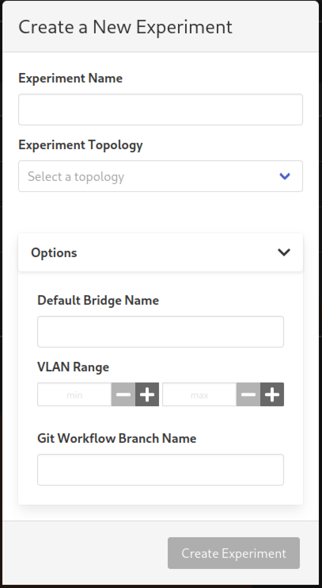
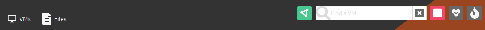
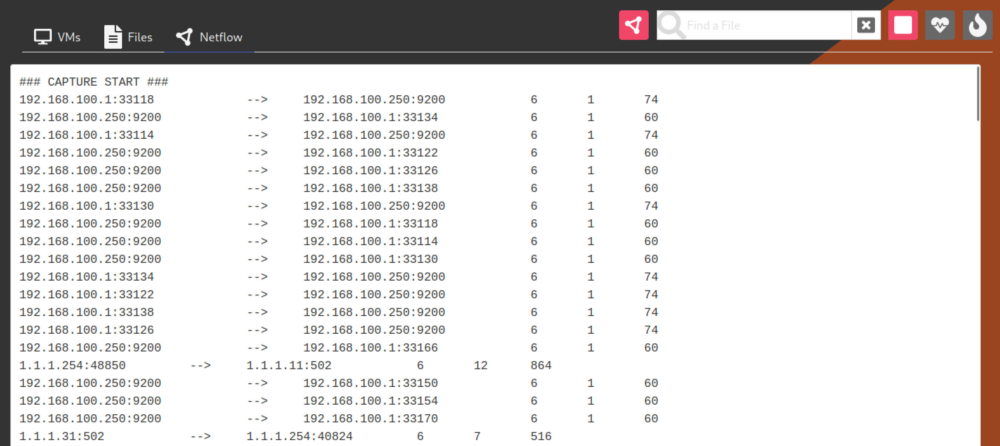

# Experiment Netflow

The minimega platform supports [netflow
capture](https://sandia-minimega.github.io/#header_5.9), wherein flows
through an Open vSwitch bridge can be parsed into an ASCII format and forwarded
to a remote endpoint for additional consumption.

phēnix extends this capability by making the minimega netflow ASCII format
available for streaming over WebSockets for experiments. The only requirement
for enabling netflow for an experiment is that the experiment be configured to
use a bridge name that is not the default `phenix` bridge. This can be done via
the UI by expanding the `Options` section when creating a new experiment and
providing the `Default Bridge Name` setting.

{: width=250 .center}

This can also be done via the CLI by providing the `--default-bridge, -b` option
when using the `phenix exp create` subcommand.

!!! warning
    As mentioned above, the experiment netflow capability **will not work** if a
    default bridge name is not explicitly specified for an experiment. This is
    to prevent network flows across multiple experiments from being captured.

## Usage

Running experiments will have a green network icon to the left of the VM search
box that, when clicked, will start netflow capture for the non-default bridge
the experiment is configured to use for all VM network interfaces.

{: width=800 .center}

Once enabled, the icon will turn red (to signify it can be stopped), and a new
`Netflow` tab will appear next to the `VMs` and `Files` tabs for the running
experiment. This tab will be updated with ASCII netflow data from minimega as it
streams in.

{: width=800 .center}

To stop netflow capture for the experiment, click the red network icon.
