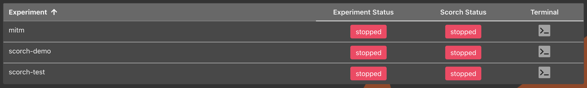
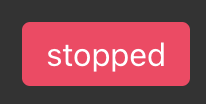
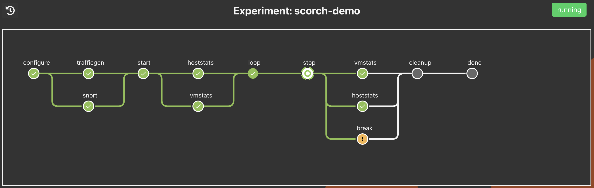
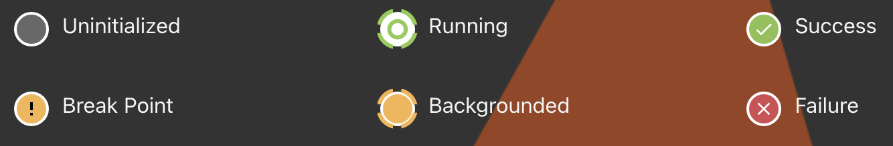
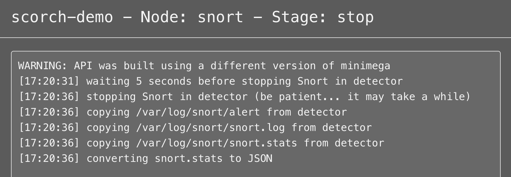
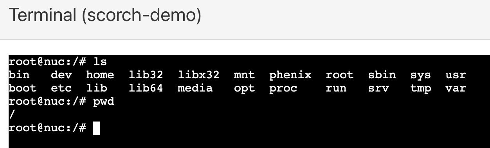

# Scorch

Scorch &mdash; **SC**enario **ORCH**estration &mdash; is an automated scenario orchestration framework within phenix. It is included in phenix as a [core app](apps.md#additional-core-apps). The development of the Scorch framework was motivated by the need to facilitate rigorous experimentation. Some advantages of Scorch include the ability to run many repeated scenarios on an experiment with consistency and minimal overhead. Scorch also provides the ability to efficiently capture experimental data for retrieval and analysis.

A phenix [scenario](configuration.md#scenario) configuration file is used to define and configure the Scorch app for use on a topology. The Scorch app is meant to allow for the staging of [Scorch components](#scorch-components) in sequence to execute against a running experiment. When applied to a given topology, the Scorch app will be available in the Scorch table to execute and then observe, manipulate in some cases, and review output from available components for a given [stage](#stages) in the [Scorch pipeline](#scorch-pipeline).

The screenshots and [configuration file](#example-configuration) in the rest of this document are from an example Scorch app, `scorch-demo`.

## Scorch Components

A Scorch component is simply an executable available to be called by the Scorch app within phenix. A component is expected to implement any or all of the various [stages](#stages) in the [Scorch pipeline](#scorch-pipeline).

For an executable to be considered a Scorch component, it must meet the following requirements:

1. Follow the `phenix-scorch-component-<type>` naming convention, where `<type>` is the component type used in the Scorch app configuration. An example would be `phenix-scorch-component-tcpdump`.
1. Be an executable file.
1. Be in the `PATH` of the user running phenix.

When the Scorch app executes a Scorch component, it will pass a number of positional arguments to the component via the command line, as well as the JSON representation of the experiment the component is to be executed against via STDIN. The positional arguments passed are as follows:

1. run stage (`configure`, `start`, `stop`, or `cleanup`)
1. component name (name given to component type in Scorch app configuration)
1. run ID (integer `>= 0` representing the array index of the Scorch run in the app configuration being executed)
1. loop (integer `>= 0` representing the current run loop being executed)
1. count (integer `>= 0` representing the current loop count being executed)

During component execution, the Scorch app assumes anything written to STDOUT by a component is intended to be relayed to the user. Thus, when Scorch is run via the web UI, anything written to STDOUT gets streamed to the UI for viewing. Any error messages generated by a component should be written to the log file or to STDERR unless it's to also be relayed to the user directly.

The Scorch app expects a component executable to exit with a value of `0` upon completion if the component was successful, and exit with any other value otherwise. An exit value of anything other than `0` will result in Scorch halting execution of the current stage and jumping to the next appropriate stage to complete the Scorch run.

### Automated Component Data Collection

The Scorch app is capable of generating a configuration file for and starting an instance of [Filebeat](https://www.elastic.co/beats/filebeat) in the background before execution of each Scorch run. As each Scorch component is executed, any data it generates and collects can be configured to be automatically processed by Filebeat for indexing in [Elasticsearch](https://www.elastic.co/elasticsearch/). At a minimum, this requires the following.

1. Filebeat to be enabled and configured in the Scorch app configuration.
1. A Filebeat input to be configured for each component generating and collecting data.
1. The `filebeat` executable installed and in the `PATH` of the user running phenix.

See the [example configuration](#example-configuration) below for examples of how Filebeat and Filebeat inputs are configured in the Scorch app configuration.

### Built-in Components

The following Scorch component types are considered `core` components, in that they are included in the main phenix repository and are available for use in Scorch app configurations by default.

- break
- pause
- soh
- tap

#### `break` Component

The `break` component is comparable to a source code break point when debugging an application in that it pauses execution of the current Scorch run until a user exits the break. While the `break` component is running, users have access to a shell on the server running phenix as the user running phenix. The first user to access the shell via the terminal modal in the UI will have read-write access. If other users access the shell, they will have read-only access but will get live updates as the user with read-write access uses the terminal.

It's possible to configure the `break` component in the Scorch app configuration to create a minimega tap when the component is executed. When the component is executed, the tap will be deleted. In addition to the tap, external network access can also be configured (e.g., Internet access).

An example of configuring a `break` component to create a tap and configure external network access during the `configure` stage is as follows. The `break` component can be configured to run in any stage.

```yaml
spec:
  apps:
  - name: scorch
    metadata:
      components:
      - name: break-tap
        type: break
        metadata:
          tap:
            bridge: phenix
            vlan: MGMT
            ip: 172.16.33.25/16
            internetAccess: true
      runs:
      - configure: ["break-tap"]
```

#### `pause` Component

The `pause` component is similar to the `break` component in that it pauses execution of the current Scorch run, but instead of waiting for user intervention it simply pauses for a predefined duration.

A simple example is as follows. The `pause` component can be configured to run in any stage. The value used for the `duration` key should be a valid [Golang duration string](https://pkg.go.dev/time#ParseDuration).

```yaml
spec:
  apps:
  - name: scorch
    metadata:
      components:
      - name: brief-pause
        type: pause
        metadata:
          duration: 2s
      runs:
      - start: ["brief-pause"]
```

#### `soh` Component

The `soh` component allows users to execute the [State of
Health](state-of-health.md) app at scheduled times throughout a Scorch run. This
is handy when, for example, other Scorch components might cause nodes in the
experiment to misbehave or fail. The component can be configured to limit which
health checks are run, and can also be configured to fail if any of the health
checks fail. The log level can also be configured, which will limit what logs
get sent to the component's UI modal while the component is running.

```yaml
spec:
  apps:
  - name: scorch
    metadata:
      components:
      - name: health-check
        type: soh
        metadata:
          c2Timeout: 5s # if provided, will update the C2 timeout setting when this component runs the state of health app
          checks:       # default is to run all the following checks
            - network-config       # Ensure all nodes still have network configured per the topology. Will use `skipInitialNetworkConfigTests` setting in soh app config.
            - reachability         # Basic ICMP-based reachability testing. Will use `testReachability` setting in soh app config.
            - custom-reachability  # IP-based reachability testing (TCP or UDP). Will use `testCustomReachability` setting in soh app config.
            - processes            # Ensure processes are running in nodes. Will use `hostProcesses` setting in soh app config.
            - ports                # Ensure listeners are running in nodes. Will use `hostListeners` setting in soh app config.
            - custom               # Run custom tests in nodes. Will use `hostCustomTests` setting in soh app config.
            - cpu-load             # Gather CPU load stats from nodes.
            - flows                # Gather paket flows from ElasticSearch server. Requires `packetCapture` setting to be cofigured in soh app config.
          failOnError: true # default is false
          logLevel: debug   # default is info
      runs:
      - start: ["health-check"]
```

#### `tap` Component

The `tap` component implements the exact same functionality described above in the `break` component for creating a minimega tap and, optionally, external network access, but allows for the tap (and external network access, if configured) to exist while other components are executed (as opposed to only existing for the duration of the `break` component).

An example of configuring a `tap` component to create a tap and configure external network access is as follows. The `tap` component can only be configured to run in the `start` stage (create the tap) and the `stop` stage (delete the tap).

```yaml
spec:
  apps:
  - name: scorch
    metadata:
      components:
      - name: tap-inet
        type: tap
        metadata:
          bridge: phenix
          vlan: MGMT
          ip: 172.16.33.25/16
          internetAccess: true
      runs:
      - start: ["tap-inet"]
      - stop: ["tap-inet"]
```

**NOTE:** In deployments where `minimega` is running in a container on the headnode, and Docker networking is in use (e.g., the `minimega` container is **not** configured to use host networking), users will need to execute the following commands if access to the `minimega` tap created by the `tap` (or `break`) component from the Docker host is required.

```
ovs-docker add-port phenix TDN minimega
docker exec -it minimega ovs-vsctl add-port phenix TDN
ovs-vsctl add-port phenix temp-tap tag=<vlan ID> -- set interface temp-tap type=internal
```

The above commands assume the name of the minimega container is `minimega`. The name of the local tap created (in this case, `temp-tap`) can be whatever, but the value for the VLAN tag must match the numerical ID of the VLAN that's mapped to the VLAN alias used in the `tap` (or `break`) component configuration.

> Using host networking mode for the `minimega` container allows for all the above nonsense to be skipped.

### User-defined Components

The following Scorch component types have been developed external to the main phenix repository and are available in the [sceptre-phenix-apps](https://github.com/sandialabs/sceptre-phenix-apps/tree/main/src/python/phenix_apps/apps/scorch) repository, which also includes README-based documentation for each component. They are all developed in Python, and leverage common helper classes that ease the development of user components.

| App | Link | Description |
| --- | ------ | ----------- |
| art | [link](https://github.com/sandialabs/sceptre-phenix-apps/tree/main/src/python/phenix_apps/apps/scorch/art) | Atomic Red Team |
| caldera | [link](https://github.com/sandialabs/sceptre-phenix-apps/tree/main/src/python/phenix_apps/apps/scorch/caldera) | Executes operations in [MITRE Caldera](https://caldera.mitre.org/) via the REST API. |
| cc | [link](https://github.com/sandialabs/sceptre-phenix-apps/tree/main/src/python/phenix_apps/apps/scorch/cc) | minimega Command and Control (cc) Component. |
| collector | [link](https://github.com/sandialabs/sceptre-phenix-apps/tree/main/src/python/phenix_apps/apps/scorch/collector) | Collects and processes data from cyber-physical experiments and Scorch components. |
| disruption | [link](https://github.com/sandialabs/sceptre-phenix-apps/tree/main/src/python/phenix_apps/apps/scorch/disruption) | Orchestrates and executes disruption scenarios for cyber-physical experiments. |
| ettercap | [link](https://github.com/sandialabs/sceptre-phenix-apps/tree/main/src/python/phenix_apps/apps/scorch/ettercap) | Component that runs Ettercap, relies on `ettercap` executable in the VM. |
| hoststats | [link](https://github.com/sandialabs/sceptre-phenix-apps/tree/main/src/python/phenix_apps/apps/scorch/hoststats) | Collects statistics on minimega host(s). |
| iperf | [link](https://github.com/sandialabs/sceptre-phenix-apps/tree/main/src/python/phenix_apps/apps/scorch/iperf) | Collects network performance measurements using [iperf3](https://github.com/esnet/iperf) or [rperf](https://github.com/opensource-3d-p/rperf). |
| mm | [link](https://github.com/sandialabs/sceptre-phenix-apps/tree/main/src/python/phenix_apps/apps/scorch/mm) | minimega (mm) Component. |
| opcexport | [link](https://github.com/sandialabs/sceptre-phenix-apps/tree/main/src/python/phenix_apps/apps/scorch/opcexport) | Exports data from an OPC server to Elasticsearch. |
| pcap | [link](https://github.com/sandialabs/sceptre-phenix-apps/tree/main/src/python/phenix_apps/apps/scorch/pcap) | Collects PCAPs from VMs via minimega's `capture pcap` API. |
| pipe | [link](https://github.com/sandialabs/sceptre-phenix-apps/tree/main/src/python/phenix_apps/apps/scorch/pipe) | Implements minimega `pipe` API. |
| qos | [link](https://github.com/sandialabs/sceptre-phenix-apps/tree/main/src/python/phenix_apps/apps/scorch/qos) | Apply Quality of Service (QoS) effects on network interfaces, including dropping packets (loss), delaying packets (delay), or limiting bandwidth (rate). |
| rtds | [link](https://github.com/sandialabs/sceptre-phenix-apps/tree/main/src/python/phenix_apps/apps/scorch/rtds) | Collects and verifies data from the Real-Time Dynamic Simulator (RTDS), and orchestrates the starting/stopping of RSCAD cases. |
| snort | [link](https://github.com/sandialabs/sceptre-phenix-apps/tree/main/src/python/phenix_apps/apps/scorch/snort) | Configures and runs [Snort](https://www.snort.org/). Snort must be installed on VMs. |
| tcpdump | [link](https://github.com/sandialabs/sceptre-phenix-apps/tree/main/src/python/phenix_apps/apps/scorch/tcpdump) | Executes and collects and processes data from `tcpdump`. |
| trafficgen | [link](https://github.com/sandialabs/sceptre-phenix-apps/tree/main/src/python/phenix_apps/apps/scorch/trafficgen) | Traffic Generator. |
| vmstats | [link](https://github.com/sandialabs/sceptre-phenix-apps/tree/main/src/python/phenix_apps/apps/scorch/vmstats) | Collects resource utilization statistics from Linux VMs in the experiment, using the `vmstats` command. |

## Scorch Table

The Scorch table, accessible as one of the tab selections within the phenix UI, lists all possible Scorch apps available based on the experiments established in phenix. The following columns or functions are available:

- Experiment name
- Experiment status: this reports on the status of the experiment &mdash; an experiment must be running for a Scorch app to start
- Scorch app status: this will report the running or stopped status of the Scorch app itself
- Terminal: if the Scorch app has reached a break point, a terminal will be available &mdash; if clicked, a terminal dialog will be opened and is running on the phenix host system
- Find an Experiment: similar to the search fields in other tables within the phenix UI, it is possible to filter experiment names based on terms entered here



## Scorch Pipeline

Scorch pipelines are available on the [Scorch table](#scorch-table) in the phenix UI. The table is sorted by Experiment name by default. Only those experiments with the Scorch app configured in the [scenario](configuration.md#scenario) configuration will be listed in the table. It is possible to _start_ or _stop_ an experiment, as well as _start_ or _stop_ a Scorch component. Finally, if a terminal is available when a break point is reached in a running Scorch app, it can be accessed from the table.

The Scorch pipeline provides a graphical representation of the Scorch app, including the `configure, start, stop, and cleanup` stages. If the Scorch app provides output for a given step, or component, users can click into the component and receive the output. A user can access the terminal if a break point is reached by clicking on the component. As with the terminal access described above, a dialog will be presented with a terminal running on the phenix host system.


The following functions are also available in the Scorch pipeline UI:

- Return to the table: a button that will return to the Scorch table
- Scorch app status: a button that will allow a running Scorch app to be stopped or started depending on the current status

{: width=200 .center}

{: width=300 .center}

### Stages

For a given Scorch pipeline, there are four stages of execution:

1. `configure`
1. `start`
1. `stop`
1. `cleanup`

A Scorch component may implement any or all of the various stages, and Scorch will execute each stage inside the components in order. Each component can be configured in the Scorch app scenario [configuration file](configuration.md).

> \* There is additional `done` stage in the UI obtained when `cleanup` has been completed. It is meant to report the completion of all stages in the Pipeline UI.

It's completely up to the component developer if and how an execution stage is implemented and handled by the component. If a component is configured in the Scorch app to be executed as part of a stage, but the component does not implement said stage, then the Scorch app will happily continue on to the next component in the stage (unless the component errors out if the current stage is not implemented, in which case the Scorch run will fail).



The following indicators are presented for each component of the Scorch app:

- Uninitialized: a component has not yet been reached or initialized &mdash; if the component has not yet been run, all components will be identified as uninitialized
- Running: the component is currently running and has not yet been completed
- Success: the component has completed successfully
- Break Point: a break component has been reached &mdash; a terminal should be accessible by clicking on the component
- Backgrounded: a component is running in the background
- Failure: a component has failed for some reason &mdash; reporting on the failure may be accessible by click on the component



Loops are also available within a Scorch app and are included in the configuration file. A loop supports _looping_ within a given component through additional components. Once a loop is completed, the next component is executed. There is no limit on the number of loops or depth of them. The Scorch pipeline UI supports access to each loop and will report the depth in the pipeline's title. The first loop in the `scorch-demo` app is presented in the following example; clicking the return button will return the display one level up in the loop chain (or ending at the parent Scorch app).


In addition to loops, multi-run is supported within a Scorch app. Unlike loops, multi-run allows for individual Scorch runs containing four separate stages. They are not nested in each other but are independent runs. A use case for multi-run could be executing multiple independent portions of an experiment against a topology, in any order or executing a run multiple times. There are two runs depicted in the [configuration](#example-configuration) below.

As described above, each component will provide a modal for output reporting. The output could either be a fairly straight forward report, nothing at all, or it  include logging output for a given component in the stage. The result will be streamed as it is received if the component is currently in a running component. If the component has finished running, the output will be static.



A terminal modal is available from the Scorch table when a break point component is reached; it is also available in the Scorch pipeline. There are two types of terminal modals: read-write and read-only. If another user opens a terminal modal for a given component, it will be read-only the next time a terminal is open. The following are examples of each. In the first example, a read-only terminal, the user viewing this modal is only observing what another using is executing. In the second example, a read-write terminal, the user ran two simple commands on the phenix host system.

{: width=300 .center}

{: width=300 .center}

If a component fails, the Scorch app will skip the remaining components involved in the current execution stage and jump to the next appropriate stage to complete the Scorch run. For example, if a component fails in the `Configure` stage the Scorch app will jump to the `Cleanup` stage, and if a component fails in the `Start` stage Scorch will jump to the `Stop` stage (skipping execution of any configured loops in either case).

{: width=300 .center}

## Example Configuration

```yaml
apiVersion: phenix.sandia.gov/v2
kind: Scenario
metadata:
  name: scorch-demo
spec:
  scenario:
    apps:
    - name: mirror
      metadata:
        directGRE:
          enabled: true
          mirrorBridge: phenix
          mirrorNet: 172.30.0.0/16
          mirrorVLAN: mirror
      hosts:
      - hostname: detector
        metadata:
          interface: IF0
          vlans:
          - EXP
      - name: scorch
        metadata:
          components:
          - name: vmstats
            type: vmstats
            metadata:
              filebeat.inputs:
              - enabled: true
                type: log
                json.add_error_key: true
                paths:
                - vm_stats.jsonl
                processors:
                - copy_fields:
                    fields:
                    - from: json
                      to: scorch.vmstats
                - drop_fields:
                    fields:
                    - json
                - timestamp:
                    field: scorch.vmstats.UTC
                    layouts:
                    - '2006-01-02 15:04:05'
          - name: hoststats
            type: hoststats
            background: true
            metadata:
              filebeat.inputs:
              - enabled: true
                type: log
                json.add_error_key: true
                paths:
                - host_stats.jsonl
                processors:
                - copy_fields:
                    fields:
                    - from: json
                      to: scorch.hoststats
                - drop_fields:
                    fields:
                    - json
                - timestamp:
                    field: scorch.hoststats.timestamp
                    layouts:
                    - UNIX_MS
          - name: trafficgen
            type: trafficgen
            metadata:
              scripts:
                backgroundGen: /phenix/topologies/scorch-demo/scripts/background-gen.py
                malwareGen: /phenix/topologies/scorch-demo/scripts/malware-gen.py
                trafficServer: /phenix/topologies/scorch-demo/scripts/traffic-server.py
              targets:
              - backgroundClient:
                  hostname: background-gen
                  probability: 0.01
                  rate: 10000
                duration: 30
                hostname: traffic-server
                interface: IF0
                malwareClient:
                  hostname: malware-gen
                  probability: 1.25
                  rate: 20
          - name: break
            type: break
            metadata: {}
          - name: tcpdump
            type: tcpdump
            metadata:
              convertToJSON: false
              filebeat.inputs:
              - enabled: true
                type: log
                paths:
                - tcpdump.pcap.json
                processors:
                - copy_fields:
                    fields:
                    - from: json
                      to: scorch.tcpdump
                - drop_fields:
                    fields:
                    - json
              vms:
                detector: eth0
          - name: snort
            type: snort
            metadata:
              configs:
              - dst: /etc/snort/snort.conf
                name: snort
                src: /phenix/topologies/scorch-demo/configs/snort.conf
              - dst: /etc/snort/rules/emotet.rules
                name: emotet
                src: /phenix/topologies/scorch-demo/configs/emotet.rules
              filebeat.inputs:
              - enabled: true
                type: log
                json.add_error_key: true
                paths:
                - snort-stats.jsonl
                processors:
                - copy_fields:
                    fields:
                    - from: json
                      to: scorch.snort
                - drop_fields:
                    fields:
                    - json
                - timestamp:
                    field: scorch.snort.timestamp
                    layouts:
                    - UNIX
              hostname: detector
              scripts:
                configSnort:
                  executor: bash
                  script: /phenix/topologies/scorch-demo/scripts/configure-snort.sh
              sniffInterface: eth0
              waitDuration: 5
          runs:
          - configure:
            - trafficgen
            - snort
            start:
            - hoststats
            - vmstats
            loop:
              execute:
                configure: null
                start:
                - tcpdump
                - snort
                - trafficgen
                stop:
                - trafficgen
                - snort
                - tcpdump
                cleanup: null
            stop:
            - vmstats
            - hoststats
            - break
          - start:
            - tcpdump
            - trafficgen
            stop:
            - trafficgen
            - tcpdump
          filebeat:
            enabled: true
            config:
              output.elasticsearch:
                hosts:
                - es:9200
              setup.dashboards.enabled: true
              setup.kibana.host: http://kibana:5601
```
