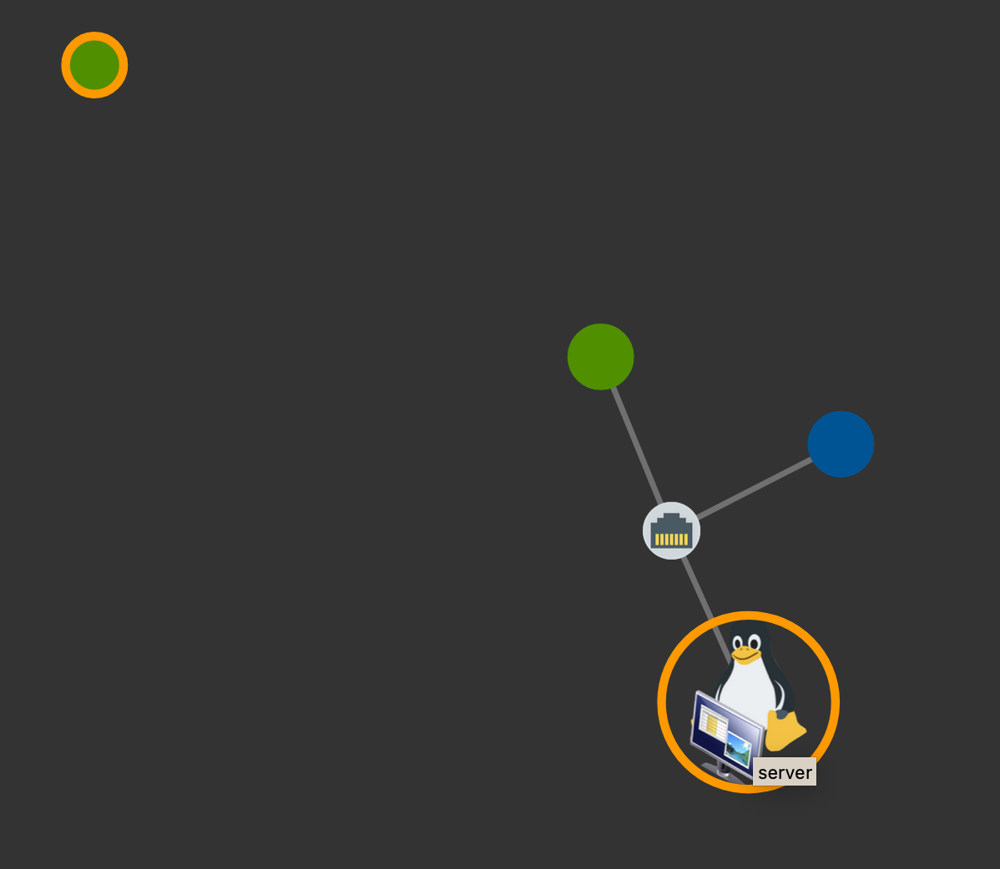
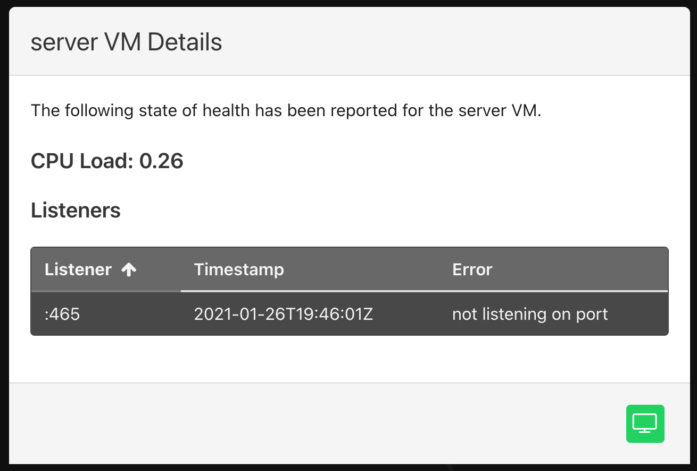
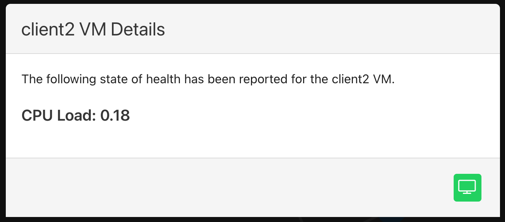
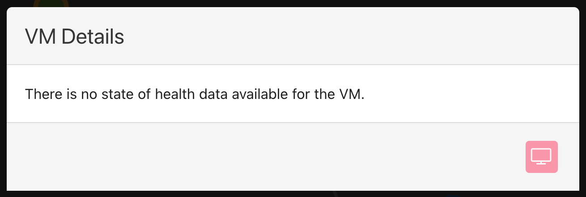
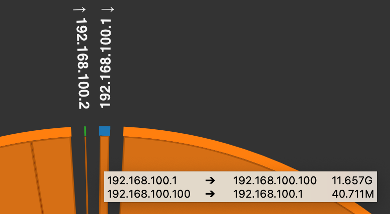
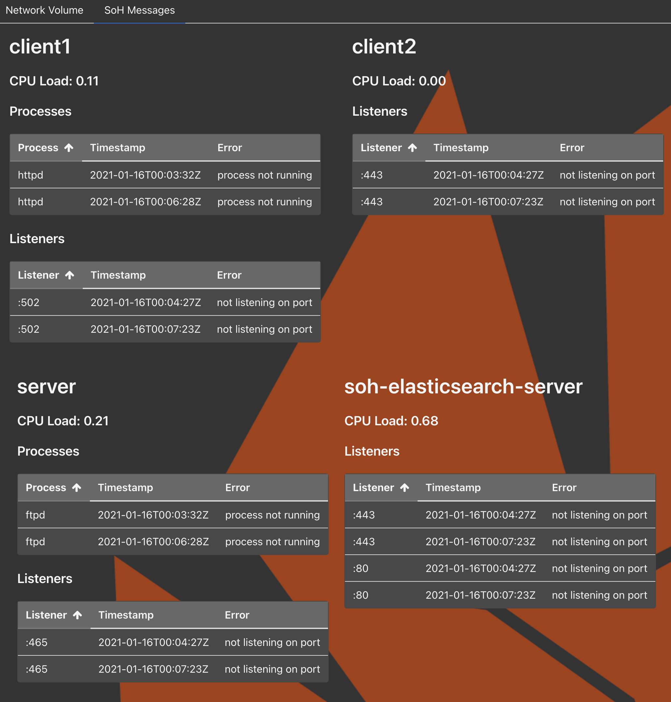

# State of Health

State of Health (SoH) is a core (but not default) app meant to assist with
understanding the state of a running experiment. It has many [configuration
options](#configuration-options), and relies on minimega's command and control
infrastructure (ie. the `miniccc` agent running in experiment VMs) to drive and
collect the experiment health state data. See the [command and
control](#command-and-control) section for more details.

SoH information is presented in the UI in three separate tabs. You can access
the information by clicking the SoH button from the Experiments or Running
Experiment components.

Button available on the experiments table.

{: width=100 .center}

Button available in running experiment.

{: width=200 .center}

## Topology Graph

This tab displays a network graph of the running experiment.

{: width=800 .center}

The color of the node is based on the condition of the corresponding VM and
could be:

* `Running`
* `Not running` (part of the experiment, but currently paused)
* `Not booted` (part of the experiment, but marked as Do Not Boot)
* `Not deployed` (part of the experiment, but flushed from minimega)
* `Experiment stopped`

{: width=800 .center}

It is also possible to filter the graph based on nodes that are either:

* `Running`,
* `Not running`,
* `Not booted`, or
* `Not deployed`.

The `Refresh Network` button will reset the filter, showing all nodes. 

The `Manual Refresh` button will request the latest server-side SoH data and
update the three tabs.

Hovering over a node in the graph will cause it to expand to show what operating
system the node is running. An orange border around a node is indicative of the
node currently having health issues (e.g., expected processes not running or not
being able to reach other nodes on the network). Other virtual systems will also
be represented accordingly (e.g., a printer or firewall).

{: width=800 .center}

Clicking on the node with an orange border will produce a details modal with the
current error reporting.

{: width=800 .center}

If there are no errors to report and command and control is enabled, the details
modal will only show the current CPU load.

{: width=800 .center}

Note the green button in the lower right corner of the modal; this will provide
access to the VNC for any running VM. When the VM is not running, access to the
VNC will be disabled. Finally, if there is no SoH information to report on a 
given VM, it will be noted in the details modal. The following screenshot is an
example of no SoH information with the VNC button disabled.

{: width=800 .center}

## Network Volume

This tab displays a chord graph that shows network flows between nodes using
flows from PacketBeat fed to ElasticSearch; connections represent the volume of
traffic between nodes.

!!! tip
    This information is only available if the packet capture option is enabled
    for SoH.

This is an example chord graph of a Protonuke server with two clients; one of
which is requesting content at a delayed interval (therefore less traffic flow).

{: width=800 .center}

If you hover over traffic flow, a tooltip will appear providing additional
details. (In this screenshot, the mouse is hovering over the traffic for IP
`192.168.100.1`.)

{: width=800 .center}

## SoH Messages

The final tab will display any error messages from the SoH agents.

{: width=800 .center}

## Configuration

Just like any other app, the SoH app is configured via the `Scenario`
configuration. SoH will only be enabled for an experiment if it's present in the
scenario as `soh`, and has multiple configuration options available, described
in detail below.

### Sample SoH Scenario Config

```
spec:
  apps:
  - name: soh
    metadata:
      appMetadataProfileKey: sohProfile # metadata key to look for in other apps
      c2Timeout: 5m
      exitOnError: false
      hostCustomTests:
        host-00:
        - name: FooBarTest
          testScript: |
            cat /etc/passwd | grep root
          validateStdout: |
            count=$(wc -l)
            [[ $count -eq 1 ]] && exit 0 || exit 1
          executor: bash
        host-01:
        - name: SuckaTest.ps1
          testScript: |
            Get-Process miniccc -ErrorAction SilentlyContinue
          testStdout: miniccc
          executor: powershell -NoProfile -ExecutionPolicy bypass -File
      hostListeners:
        client:
        - :502
        server:
        - :80
        - :443
      hostProcesses:
        client:
        - miniccc
        server:
        - miniccc
      hostsToUseUUIDForC2Active:
      - host-02
      injectICMPAllow: true
      packetCapture:
        elasticImage: /phenix/images/elasticsearch.qc2
        packetBeatImage: /phenix/images/packetbeat.qc2
        elasticServer:
          hostname: soh-elasticsearch-server
          vcpus: 4
          memory: 4096
          ipAddress: 172.16.200.1/16
          vlan: MGMT
        captureHosts:
          client:
          - IF0 # interface to monitor on "client" node in topology
          server:
          - IF0 # interface to monitor on "server" node in topology
      skipInitialNetworkConfigTests: false # if true, testReachability will be off
      skipHosts:
      - kali.qc2 # can be an image name, in which case any host using image will be skipped
      - foobar-host # can be hostname from topology
      testReachability: full # can be off, sample, or full
      testCustomReachability:
      - src: host-00
        dst: host-01|IF0
        proto: tcp
        port: 22
        wait: 30s
      - src: host-01
        dst: host-00|IF0
        proto: tcp
        port: 22
        wait: 30s
```

### Configuration Options

* `appMetadataProfileKey`: since the listeners and processes one might want to
  monitor could be highly dependent on other apps that are configured for an
  experiment, it's possible to specify the `hostListeners` and `hostProcesses`
  to be monitored in the other apps themselves under the key specified here.
  The default key is `sohProfile`.

* `c2Timeout`: a [Golang duration
  string](https://golang.org/pkg/time/#ParseDuration) specifying how long to
  wait for the `miniccc` C2 client to become active in a VM before moving on and
  marking the VM as not to be monitored. The default is `5m`.

* `exitOnError`: a boolean representing whether the app should cause the entire
  experiment deployment to fail if it has any errors. The default is `false`.

* `hostCustomTests`: If present, a map of custom tests to run on the given
  hosts.

    * `name`: name of test. Used as script name to be sent to the host.

    * `testScript`: the actual script (can be multiple lines) to be executed
      using the specified `executor`.

    * `executor`: the application to execute the `testScript` with (e.g. `bash`,
      `powershell`).

    * `testStdout`: a string to look for in STDOUT from the executed script. If
      found, the test passes. If not found, it fails.

    * `testStderr`: a string to look for in STDERR from the executed script. If
      found, the test passes. If not found, it fails.

    * `validateStdout`: a script to run that will be provided, via STDIN, the
      STDOUT from the executed script. If this validation script exits 0, the
      test passes. If it exits non-zero, the test fails. This validation script
      should always be a bash script, even if the host is a Windows host.

    * `validateStderr`: a script to run that will be provided, via STDIN, the
      STDERR from the executed script. If this validation script exits 0, the
      test passes. If it exits non-zero, the test fails. This validation script
      should always be a bash script, even if the host is a Windows host.

* `hostListeners`: a map of VMs, each specifying a list of listening ports to
  check for within the VM. If the port can be listening on any interface, the
  form `:80` can be used. If the port should be listening on a specific
  interface, the form `192.168.1.10:80` can be used. The default is `nil`.

* `hostProcesses`: a map of VMs, each specifying a list of process names to
  check for within the VM. The default is `nil`.

* `hostsToUseUUIDForC2Active`: a list of topology hostnames to use the minimega
  VM UUID for when determining if their cc agent is active. This is useful for
  topology nodes that are configured with snapshots disabled, preventing their
  hostname from getting updated when booted. Note that this configuration option
  also supports being set to `all` (e.g., `hostsToUseUUIDForC2Active: all`) if a
  user wishes to use the minimega VM UUID for all topology nodes.

* `injectICMPAllow`: a boolean representing whether any existing firewall/router
  rulesets should have a rule added to allow ICMP between all nodes to
  facilitate reachability testing. See [Injecting ICMP
  Rules](#injecting-icmp-rules) for more details. If reachability tests are
  disabled, then this will be too, regardless of its setting here. The default
  is `false`.

* `packetCapture`: if present, a partially hidden packet capture infrastructure
  based on Elastic, Kibana, and PacketBeat will be deployed for the experiment.
  See [Packet Capture](#packet-capture) for more details. The default is `nil`.

    * `elasticImage`: path to the disk image to use for the Elastic/Kibana VM
      for packet capture. An `image/elasticsearch` config comes bundled with
      phenix and can be used to build an image to use here. There is no default
      for this setting; if packet capture is to be deployed it must be provided.

    * `packetBeatImage`: path to the disk image to use for the PacketBeat VM for
      packet capture. An `image/packetbeat` config comes bundled with phenix and
      can be used to build an image to use here. There is no default for this
      setting; if packet capture is to be deployed it must be provided.

    * `elasticServer`: 

        * `hostname`: the hostname to use for the Elastic/Kibana server added to
          the experiment topology. There is no default for this setting; if
          packet capture is to be deployed it must be provided.

        * `vcpus`: the number of CPUs to assign to the Elastic/Kibana server VM.
          The default is 4.

        * `memory`: the amount of memory to assign to the Elastic/Kibana server
          VM. The default is 4096.

        * `ipAddress`: the IP address to use for the Elastic/Kibana server added
          to the experiment topology. The network interface this IP address is
          used for will be added to the experiment VLAN specified by `vlan`. The
          IP address should be specified in CIDR notation. There should also be
          sufficient IP addresses after the one specified here to be assigned to
          each of the PacketBeat monitor VMs that will be deployed, as the IP
          addresses assigned to them on the VLAN specified by `vlan` will
          increment up from this IP. There is no default for this setting; if
          packet capture is to be deployed it must be provided.

        * `vlan`: the experiment VLAN to add the Elastic/Kibana and PacketBeat
          VMs to. There is no default for this setting; if packet capture is to
          be deployed it must be provided.

    * `captureHosts`: a map of VMs, each specifying a list of network interface
      names to monitor. One PacketBeat VM will be deployed for each VM interface
      specified. The defalt is `nil`.

* `skipInitialNetworkConfigTests`: by default, a set of tests will be run on
  each VM to ensure the VM was assigned the correct IP address and can reach its
  default gateway (if specified). Setting this to true will skip these initial
  tests, but will also disable reachability testing. The default is `false`.

* `skipHosts`: a list of VM hostnames and/or disk image names to skip health
  monitoring for. For disk image names, any host using the disk image as its
  primary image will be skipped. The default is `nil`.

* `testReachability`: reachability testing is the process of making sure each VM
  can reach other VMs within the experiment over the network. See [Network
  Reachability](#network-reachability) for more details. There are three options
  for this setting: `off, sample, full`.

    * `off`: reachability testing is disabled. This is the default.

    * `sample`: each VM in the experiment will attempt to ping a random VM in
      every other experiment VLAN.

    * `full`: each VM in the experiment will attempt to ping every other VM in
      every other experiment VLAN.

* `testCustomReachability`: if present, a list of custom reachability test
  settings.

    * `src`: hostname to conduct test from.

    * `dst`: hostname and interface name (e.g. `host-01|IF0`) to conduct test
      to.

    * `proto`: protocol to use for test. Currently the options are `tcp` and
      `udp`. If `udp` is used, the `udpPacketBase64` setting must be provided.

    * `port`: destination port to conduct test to.

    * `wait`: amount of time to wait for a response from the destination. If not
      provided, the default of `5s` is used.

    * `udpPacketBase64`: a base64-encoded packet to send when testing using
      `udp`. This is required to generate a response over UDP to determine if
      the remote server is up and reachable. The given packet must be valid
      enough to generate a response from the server.

### Network Reachability

Testing network reachability for a VM requires that the VM has minimega's
command and control (C2) layer active (ie., the `miniccc` agent is running in
the VM), has the correct IP address configured, and can ping its default route
if one is configured. If C2 is not active for a VM after the `c2Timeout`
duration has passed, then the VM will be excluded from reachability testing.
Once C2 is up for a VM, the VM is queried to confirm its IP address is
configured and its gateway is reachable for a maximum of 5 minutes. Once all the
VMs with C2 detected have their IP address configured and their gateways are
reachable, reachability tests begin.

Reachability tests are run in the post-start stage and each time the running
stage is triggered. Given this, if for some reason a VM comes up with its C2
agent active, but its network has to be configured manually, it will not be
included in reachability tests during the post-start stage. Once the VM's
network settings have been configured manually, the running stage can be
triggered and the VM will be included in reachability tests this time around.

!!! note
    Support for custom reachability testing using TCP or UDP currently requires
    the use of the `activeshadow/minimega@tcp-conn-test` branch until [PR
    1457](https://github.com/sandia-minimega/minimega/pull/1457) is merged.

### Injecting ICMP Rules

The `injectICMPAllow` option can be used to add rules to routers/firewalls in
the topology to prevent reachability tests from failing due to ACLs. When
enabled, all rulesets present in the experiment (either in the topology or
scenario) will have a rule prepended to the list of existing rules allowing the
ICMP protocol to/from any address. To ensure this rule is applied before any
other rule, the SoH app attempts to inject it with an ID of 1 (since Vyatta/VyOS
orders rules by ID). If a rule already exists with an ID of 1 then injecting
this rule will fail.

A check is done each time an experiment is started to see if injecting ICMP
rules is enabled, and if not, any injected rules are removed from the
experiment. This means the setting can be changed between runs of an experiment
(e.g., using `phenix config edit experiment/<name>`) and the change will be
reflected accurately when the experiment is started again.

### Packet Capture 

The SoH packet capture capability leverages minimega's tap mirroring to monitor
traffic on experiment VM interfaces with PacketBeat and feed network flow data
to ElasticSearch.

When enabled, an Elastic/Kibana VM is added to the experiment's topology so it
can be accessed via the phenix UI. PacketBeat VMs are deployed in minimega for
each experiment VM interface that's configured to be monitored, but are not
added to the experiment topology so they do not clutter the phenix UI.

When packet capture is enabled, the phenix UI SoH tab will include a Network
Volume tab that uses network flow data queried from ElasticSearch to populate a
chord graph in an effort to depict how much traffic is flowing between VMs.
Users/Analysts can also access Kibana using VNC via the phenix UI to do
additional analysis on the network flow data that's being captured.

## Command and Control

As mentioned above, SoH relies on minimega's command and control infrastructure
to drive and collect the experiment health state data. Under the hood, the SoH
app uses C2 to execute a test on a VM (`cc exec`), wait for the command to
complete (`cc commands`), grab the STDOUT/STDERR of the command (`cc
responses`), and compare it to an expected response. Current tests executed on
Linux VMs include the following:

* `ip addr`
* `ip route`
* `ping -c 1 <ip>`
* `pgrep -f <process>`
* `ss -lntu state all 'sport = <port>'`
* `cat /proc/loadavg`

Corresponding tests for Windows VMs include the following:

* `ipconfig /all`
* `route print`
* `ping -n 1 <ip>`
* `powershell -command "Get-Process <process> -ErrorAction SilentlyContinue"`
* `powershell -command "netstat -an | select-string -pattern 'listening' | select-string -pattern '<port>'"`
* `powershell -command "Get-WmiObject Win32_Processor | Measure-Object -Property LoadPercentage -Average | Select Average"`
