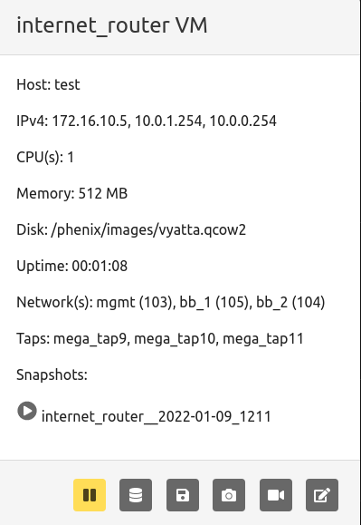
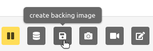
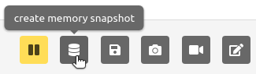
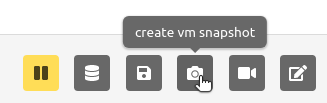
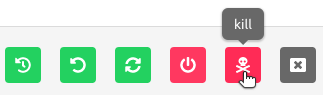
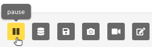
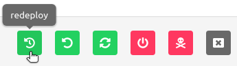
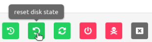
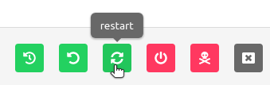

# VMs

## VM Info

### From the Web-UI

The experiment must be started; click on the experiment name to enter the
Running Experiment component. Within that component, click on the VM name and
you will be presented with a VM information modal.



Available commands

* `restore` a snapshot by clicking the play button next to the desired snapshot name.

Buttons from left to right:

* `pause` a running VM
* Create a `memory snapshot` of a running VM
* Create a `backing image` of a running VM
* Create a `snapshot` of a running VM
* `record screenshot` of a running VM
* `modify state` opens another toolbar of buttons

#### Modify State Toolbar


Buttons from left to right:

* `redeploy` a running VM
* `reset disk state` of a running VM
* `restart` a running VM
* `shutdown` a running VM
* `kill` a running VM
* `close` modify state toolbar

### From the Command Line Binary

There are two options for displaying the information for VMs in an experiment. First run 
the following command to see information for all VMs in a given experiment.

```shell
phenix vm info <experiment name>
```

Or, run the following to see the information for a specific VM in an experiment.

```shell
phenix vm info <experiment name> <vm name>
```

## Create a Backing Image

### From the Web-UI

Click on the name of a running VM in a started experiment to access the VM information 
modal.  Click the `create backing image` button as shown in the screenshot below.



### From the Command Line Binary

Not applicable.

## Create a Memory Snapshot

### From the Web-UI

Click on the name of a running VM in a started experiment to access the VM information
modal.  Click the `memory snapshot` button as shown in the screenshot below.



### From the Command Line Binary

To create an ELF memory dump, run the following command.

```shell
phenix vm memory-snapshot <experiment name> <vm name> <snapshot file path>
```

## Create a VM Snapshot

### From the Web-UI

Click on a running VM in a started experiment to access the VM information
modal.  Click the `vm snapshot` button as shown in the screenshot below.



### From the Command Line Binary

Not applicable.

## VM VNC Access

### From the Web-UI

The experiment must be started; click on the VM screenshot to open a new browser
tab that provides VNC access to the VM.

### From the Command Line Binary

Not applicable.

## Packet Capture

### From the Web-UI

Click on the name of the network tap on a running VM in a started experiment to 
start a packet capture. The name of the network tap will turn green once a packet 
capture has started. It is possible to start captures on multiple network taps. 
However, when you stop packet capture, it will stop captures on all network taps.

### From the Command Line Binary

To start a packet capture, run the following command.

```shell
phenix vm capture start <experiment name> <vm name> <iface index> </path/to/out file>
```

To stop all packet captures on a running VM, use the following command.

```shell
phenix vm capture stop <experiment name> <vm name>
```

## Kill a VM

### From the Web-UI

Click on the name of a running VM in a started experiment to access the VM information 
modal. Click the `modify state` button on the far right to open the modify state toolbar.
Click the `kill` button as shown in the screenshot below.



_Note_: if you stop and then start the experiment again, that VM will run again 
per the experiment configuration.

### From the Command Line Binary

To kill a VM, run the following command.

```shell
phenix vm kill <experiment name> <vm name>
```

## Modify the Network Connectivity

### From the Web-UI

Click on the network for the desired VM in the Running Component to modify the 
settings. Select from a pull down what network you want to switch the VM interface 
you clicked on to. To revert back to previous setting, simply repeat selecting the 
network interface you wish to change, and select the previous network setting.

### From the Command Line Binary

To connect a VM network interface to a different network, run the following command.

```shell
phenix vm net connect <experiment name> <vm name> <iface index> <vlan id>
```

To disconnect a VM network interface, run the following command.

```shell
phenix vm net disconnect <experiment name> <vm name> <iface index>
```

## Pause a VM

### From the Web-UI

Click on the name of a running VM in a started experiment to access the VM information 
modal. To pause a VM, click on the `pause` button as shown in the screenshot below.
To start a paused VM, that same button will become a green play button; simply 
click it to start.



### From the Command Line Binary

To pause a VM, run the following command.

```shell
phenix vm pause <experiment name> <vm name>
```

To resume a paused VM, run the following command.

```shell
phenix vm resume <experiment name> <vm name>
```

## Redeploy a VM

### From the Web-UI

Click on the name of a running VM in a started experiment to access the VM information 
modal. Click the `modify state` button on the far right to open the modify state toolbar.
Click the `redeploy` button as shown in the screenshot below.



### From the Command Line Binary

To redploy a VM, run the following command.

```shell
phenix vm redeploy <experiment name> <vm name>
```

## Reset Disk State

### From the Web-UI

Click on the name of a running VM in a started experiment to access the VM information 
modal. Click the `modify state` button on the far right to open the modify state toolbar.
Click the `reset disk state` button as shown in the screenshot below.



### From the Command Line Binary

To reset the first disk to the initial pre-boot state, run the following command.

```shell
phenix vm reset-disk <experiment name> <vm name>
```

## Restart a VM

### From the Web-UI

Click on the name of a running VM in a started experiment to access the VM information 
modal. Click the `modify state` button on the far right to open the modify state toolbar.
Click the `restart` button as shown in the screenshot below.



### From the Command Line Binary

To restart a VM, run the following command.

```shell
phenix vm restart <experiment name> <vm name>
```

## Resume a VM

### From the Web-UI

Click on the name of the paused VM in a started experiment to access the VM information 
modal. Click the green play button (previously the pause button, furthest button to the 
left).

### From the Command Line Binary

To resume a paused VM, run the following command.

```shell
phenix vm resume <experiment name> <vm name>
```

## Shutdown a VM

### From the Web-UI

Click on the name of a running VM in a started experiment to access the VM information 
modal. Click the `modify state` button on the far right to open the modify state toolbar.
Click the `shutdown` button as shown in the screenshot below.


### From the Command Line Binary

To shutdown a VM, run the following command.

```shell
phenix vm shutdown <experiment name> <vm name>
```

## Modify VM Settings

### From the Web-UI

There are two ways to modify VM settings:

1. Click on a stopped experiment to access the Stopped Component. You are able to edit the 
following:
    * Host name
    * CPUs
    * Memory
    * Disk
    * Do not boot flag
1. From a running experiment, click on the VM name and then the redeploy button (yellow
power button, second from the right on the modal footer). You are able to edit the following:
    * CPU
    * Memory
    * Disk
    * Replication of original injections

### From the Command Line Binary

**This command is not yet implemented.** For now, you can edit the stopped experiment directly with the following command.

```shell
phenix cfg edit topology/<topology name>
```

This will launch the system editor where you can directly modify the experiment settings.

## Applying Actions to Multiple VMs

!!! note
    See [VM Multi Action](vm-multi-action.md) for documentation on applying
    actions to multiple VMs at once.
